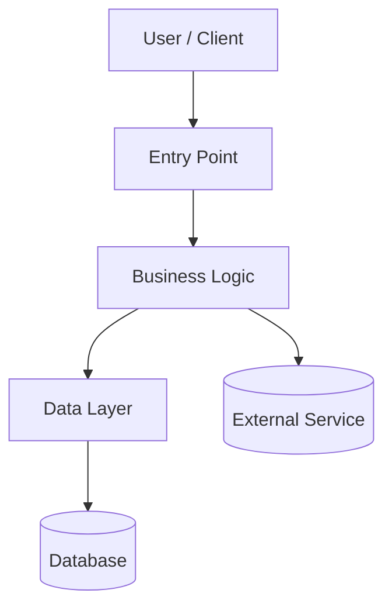

# Examples

Worked examples for key documentation formats used by the generate-docs skill.

---

## DATABASE.md — Per-Table Format

### Join + Selected operations (lookup table)

```markdown
### product_category

> Referenced in `FIND_PRODUCTS_BY_CATEGORY` and `FIND_CATEGORY_TREE`, this table maps products to their categories and provides display names.

| Column | Operation | Details |
|--------|-----------|---------|
| `category_id` | Join | [product](#product) |
| `parent_id` | Join | [product_category](#product_category) (self-referencing) |
| `name` | Selected | Displays the category name |
```

### Predicate + Selected + Join operations (core table)

```markdown
### order_item

> Referenced in `OrderRepository.findByCustomer()` and `REPORT_ITEMS_BY_DATE`, this is the core table linking orders to products and quantities.

| Column | Operation | Details |
|--------|-----------|---------|
| `customer_id` | Predicate | Matches the user-supplied customer ID |
| `customer_id` | Join | [customer](#customer) |
| `status` | Predicate | Only show items whose status is 'active' |
| `product_id` | Join | [product](#product) |
| `quantity` | Selected | Displays the quantity ordered |
| `unit_price` | Selected | Displays the price per unit |
```

### Inserted operations (audit/analytics table)

```markdown
### audit_log

> Referenced in `AuditService.logAction()`, this table records user actions for compliance and analytics.

| Column | Operation | Details |
|--------|-----------|---------|
| `user_id` | Inserted | Records the user who performed the action |
| `action_type` | Inserted | Records the type of action (e.g. 'login', 'update', 'delete') |
| `timestamp` | Inserted | Records when the action occurred |
| `resource_id` | Inserted | Records the ID of the affected resource |
| `detail` | Inserted | Records additional context about the action |
```

---

## BUSINESS_RULES.md — Rule Format

```markdown
### Rule: Maximum Search Results

**Description:** Search results are capped at 500 items per query to prevent excessive database load. If the result set exceeds 500, only the first 500 are returned and a truncation notice is displayed to the user.

**Implementation:** `SearchService.executeQuery()` in `src/main/java/com/example/service/SearchService.java`

**Related Constants/Enums:** `MAX_RESULTS = 500` in `src/main/java/com/example/config/SearchConstants.java`
```

---

## README.md — Project Links Section

```markdown
## Project Links

| Resource | URL |
|----------|-----|
| Wiki | [Link](url-from-user) |
| Repository | [Link](url-from-user) |
| Issue Tracker | [Link](url-from-user) |
| Documentation | [docs/](docs/) |
```

---

## API.md — Endpoint Table

```markdown
| Endpoint | Method | Purpose | Parameters | Response |
|----------|--------|---------|------------|----------|
| /api/search | GET | Execute a search query | q (string), limit (int), offset (int) | JSON |
| /api/search/suggest | GET | Get autocomplete suggestions | q (string), max (int) | JSON |
| /api/record/{id} | GET | Retrieve a single record | id (path) | JSON |
```

---

## DEPLOYMENT.md — CI/CD Variables Table

```markdown
#### Environment: production

| Variable | Type | Description | Used In |
|----------|------|-------------|---------|
| DEPLOY_HOST | secret | Target server hostname | deploy.sh |
| DEPLOY_PATH | variable | Deployment directory on target | deploy.sh |
| DB_PASSWORD | secret | Production database password | deploy.sh |
| SLACK_WEBHOOK | secret | Notification webhook URL | notify.sh |
| APP_VERSION | variable | Version tag for this release | build job |
```

---

## ARCHITECTURE.md — Mermaid Diagram



Adapt the diagram to the actual architecture discovered. The template is a starting point, not a constraint.

---

## Low Confidence Marker

```markdown
> ⚠️ **LOW CONFIDENCE**: This section was auto-generated with limited business context.
> Please review and enhance with accurate information.

<!-- LOW-CONFIDENCE-START -->
Based on code analysis, [inferred content here]
<!-- LOW-CONFIDENCE-END -->
```
