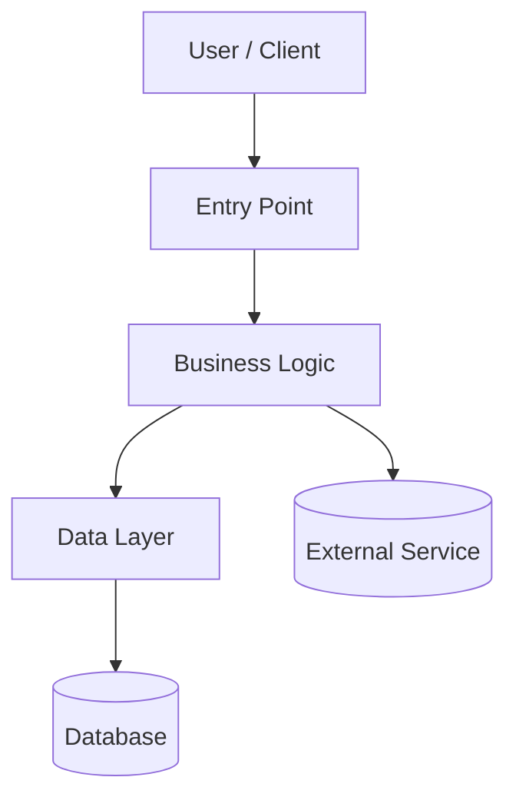

# Repository Documentation Generation Skill — Instructions

## Overview

This skill analyses repositories and generates comprehensive, multi-audience documentation. It detects the technology stack, extracts structure, dependencies, business rules, and data patterns, then creates documentation that serves four key audiences:

- **New Developers** — Getting started and productive quickly
- **Experienced Maintainers** — Understanding system design and business rules
- **DevOps Teams** — Building, deploying, and troubleshooting
- **Business Stakeholders** — Understanding functionality and data flows

The skill works with any technology stack. It includes explicit guidance for known stacks (see [Stack Hints](#stack-hints)) and falls back to generic heuristics for unknown stacks.

## Skill Philosophy

- **Analysis-first:** Understand the codebase before generating docs
- **Context-aware:** Adapt to each repository's unique characteristics
- **Human-AI collaboration:** Auto-generate verifiable content, preserve human insights
- **Ask, don't assume:** When uncertain about business context, use `ask_questions` to clarify
- **Reference, don't replicate:** Link to source code locations instead of embedding code snippets
- **Questions are mandatory:** You MUST ask the user questions during analysis — if you have zero questions, you have not analysed thoroughly enough

## Key Design Decision

Preserve existing `AGENTS.md` and `.github/copilot-instructions.md` (they serve AI agents well), and create parallel human-focused documentation that this skill maintains from code analysis.

> **CRITICAL: DO NOT MODIFY `AGENTS.md` OR `.github/copilot-instructions.md` UNDER ANY CIRCUMSTANCES.**
> These files are maintained separately and serve AI agent tooling. This skill must NEVER read, edit, overwrite, or touch these files. Only generate/update files listed in the Output Structure below.

---

## Output Structure

Generate the following documentation structure:

```
/
├── README.md                           # Main entry point (all audiences)
├── AGENTS.md                           # PRESERVED — Do not modify
├── .github/
│   └── copilot-instructions.md         # PRESERVED — Do not modify
└── docs/
    ├── README.md                       # Documentation index and guide
    ├── DEVELOPER_GUIDE.md              # Onboarding for new developers
    ├── ARCHITECTURE.md                 # System design
    ├── DATABASE.md                     # Data layer documentation
    ├── API.md                          # Endpoint documentation
    ├── BUSINESS_RULES.md               # Business logic documentation
    ├── CONFIGURATION.md                # Environment and config details
    ├── DEPLOYMENT.md                   # Build and deployment guide
    ├── DEPENDENCIES.md                 # Dependency inventory
    └── TROUBLESHOOTING.md              # Common issues and solutions
```

All 11 documents are always generated. If a document's subject is not applicable to the repository (e.g. DATABASE.md for a project with no database layer), generate the file with a brief explanation of why the section is not applicable rather than omitting it.

### Generation Rules

1. **Core docs (README through TROUBLESHOOTING):** Always generate
2. **Existing AGENTS.md and copilot-instructions.md:** NEVER modify
3. **Manual sections:** Preserve and merge with auto-generated content
4. **Low confidence sections:** Mark with warning comments for human review

---

## When to Ask Clarifying Questions

Use `ask_questions` tool when encountering uncertainty. High-quality documentation requires accurate context, not plausible guesses.

> **MANDATORY:** You MUST use `ask_questions` at least once before generating any documentation. Every project has context that cannot be inferred from code alone. If you believe you have no questions, you are wrong — re-examine your analysis for gaps in external URLs, business context, infrastructure details, and deployment environments.

Always ask questions individually, so the user can provide a single response to each question.

### ALWAYS Ask About (Mandatory Questions)

These questions MUST be asked for every project. Do not skip them even if you think you can infer the answers:

1. **External URLs** — Wiki URL, Repository URL, Jira/Issue Tracker URL (for inclusion in README.md and docs)
2. **Project Purpose & Audience** — If not clear from code/config
3. **Log File Locations** — Where application and server logs are written (do not guess or make up paths)
4. **External Systems & Integrations** — What they are, what they do, and their URLs
5. **Business Context for Technical Code** — Why business rules exist
6. **Organisation-Specific Terms** — Acronyms, abbreviations
7. **Missing or Ambiguous Configuration** — External systems, deployment targets
8. **Database Name/Identifier** — If a database layer is present (do not guess or infer)

### NEVER Guess About

- The business purpose of features
- Why specific business rules exist
- What external systems are or do
- What database tables contain (beyond column names)
- Project-specific acronyms or terminology
- Whether code is production, experimental, or deprecated
- **Log file locations or paths** — ALWAYS ask the user
- **External URLs** (wiki, repository, Jira) — ALWAYS ask the user
- **Server names, hostnames, or infrastructure details** — ALWAYS ask the user

### Confidence Thresholds

| Analysis Area | Confidence < 70% | Confidence 70–85% | Confidence > 85% |
|---------------|------------------|-------------------|------------------|
| **Project Purpose** | Ask user | Generate + flag for review | Auto-generate |
| **Business Rules** | Ask user | Generate + flag for review | Auto-generate |
| **Technical Stack** | Ask user if critical gaps | Generate with notes | Auto-generate |
| **Database Schema** | Ask user for table purposes | Infer + flag uncertain | Auto-generate |
| **External Systems** | ALWAYS ask | ALWAYS ask | Auto-generate if obvious |
| **External URLs** | ALWAYS ask | ALWAYS ask | ALWAYS ask |
| **Log Locations** | ALWAYS ask | ALWAYS ask | ALWAYS ask |
| **Database Name** | ALWAYS ask | ALWAYS ask | ALWAYS ask |

### Low Confidence Marker Format

When confidence is low and clarification isn't available:

```markdown
> ⚠️ **LOW CONFIDENCE**: This section was auto-generated with limited business context.
> Please review and enhance with accurate information.

<!-- LOW-CONFIDENCE-START -->
Based on code analysis, [inferred content here]
<!-- LOW-CONFIDENCE-END -->
```

---

## Analysis Phases

Execute these phases in order before generating documentation.

### Phase 0: Stack Detection

Before any other analysis, identify the technology stack by scanning for marker files and patterns. The detected stack determines which [Stack Hints](#stack-hints) apply throughout subsequent phases.

**Scan for (in priority order):**

| Marker | Stack |
|--------|-------|
| `pom.xml`, `build.gradle` | Java/Maven or Java/Gradle |
| `Makefile.PL`, `cpanfile`, `*.pm` in root or `lib/` | Perl |
| `composer.json` | PHP (inspect for WordPress indicators) |
| `wp-content/`, `wp-config.php`, `style.css` with `Theme Name:` | PHP + WordPress |
| `*.php` without `composer.json` | PHP (standalone) |
| `Gemfile`, `*.gemspec` | Ruby |
| `package.json` | Node.js / JavaScript / TypeScript |
| `requirements.txt`, `setup.py`, `pyproject.toml`, `Pipfile` | Python |
| `template.yaml`, `template.yml` (SAM), `*.tf`, `Dockerfile`, `docker-compose.yml` | AWS IaC / Infrastructure |
| `go.mod` | Go |
| `Cargo.toml` | Rust |
| `*.sln`, `*.csproj` | .NET / C# |

**Also detect CI/CD:**

| Marker | CI/CD Platform |
|--------|----------------|
| `.github/workflows/*.yml` | GitHub Actions |
| `bitbucket-pipelines.yml` | BitBucket Pipelines |
| `.gitlab-ci.yml` | GitLab CI |
| `Jenkinsfile` | Jenkins |

A repository may match multiple stacks (e.g. a PHP application with Docker and GitHub Actions). Record all matches and apply all relevant stack hints.

If no known stack is detected, proceed with generic heuristics — the skill still functions without stack hints.

### Phase 1: Project Metadata

**Extract from (adapt to detected stack):**

- Version control config (`.git/config`) → repository URL
- Build/package manifest (see Stack Hints for file names) → project name, version, description
- README or similar → existing project description

### Phase 2: Technology Stack

**Extract from the build/package manifest and source files:**

- Language version requirements
- Framework and library dependencies with versions
- Build tool plugins and configuration
- Runtime dependencies vs development/test dependencies

**Categorise dependencies into:**

- Core Framework (primary application framework)
- Data Access (database drivers, ORMs, query builders)
- Custom/Internal Libraries (organisation-specific)
- Testing (test frameworks, mocking libraries)
- Build & Deployment Tools
- External Service Clients (API clients, SDKs)

### Phase 3: Architecture

**Extract from source files and configuration:**

- Entry points (controllers, routes, handlers, main files)
- Service/business logic layer
- Data access layer (DAOs, repositories, models, ORM mappings)
- Configuration files and their roles
- View/template layer

**Map:**

- Presentation layer (controllers, views, templates, static assets)
- Business logic layer (services, domain models)
- Data access layer (repositories, DAOs, query objects)
- Integration layer (API clients, message queues, external service adapters)

### Phase 4: Database Layer

**Extract from source code and configuration:**

- Database connection configuration (connection strings, JNDI, environment variables)
- ORM models/entities or raw SQL queries
- Table names, column names (regex extraction from queries or model definitions)
- Migration files (schema history)

**Capture:**

- Table names and operations (INSERT, SELECT, UPDATE, DELETE)
- Column names from queries or model definitions
- Named SQL query constants or ORM scope names for use in blurbs and table descriptions
- Database-specific features (vendor-specific types, functions, extensions)

### Phase 5: Business Rules

**Extract from:**

- Code comments, docstrings, and documentation annotations
- Constants and enums → configuration values
- Validation logic in methods
- Default values and preference settings

**Identify:**

- Validation rules and constraints
- Default values and their purposes
- Access control rules
- Feature toggles and flags
- Domain-specific calculations or transformations

### Phase 6: Configuration

**Extract from:**

- Environment-specific configuration files
- Environment variable references in code and CI/CD
- Application configuration (framework config files, settings modules)
- Logging configuration
- Infrastructure configuration (web server, application server, container)

### Phase 7: Build & Deployment

**Extract from:**

- CI/CD pipeline files (see Stack Hints for file locations)
- Build scripts and commands
- Deployment triggers (branch patterns, tags)
- Build artefacts (what is produced and where)
- Shell scripts invoked by the pipeline (discover by parsing the pipeline file)

### Phase 8: Testing

**Extract from:**

- Test directories and files (see Stack Hints for conventions)
- Test frameworks in use
- CI/CD pipeline steps that run tests
- Linting and static analysis configuration

**Determine and document:**

- Whether a formal test suite exists (unit tests, integration tests, test framework)
- What automated validation is performed (linting, type checking, syntax checking)
- Whether all file types are covered by linting (check for commented-out or missing checks)
- What manual validation steps are required
- Test coverage reporting (if configured)

---

## Generation Components

### Component 1: README.md

**Purpose:** Quick orientation for all audiences

**Sections:**

1. Project Title and Description
2. Badges (build status, version)
3. Key Features (3–5 bullets) — **Ask if unclear**
4. Technology Stack (auto-generated table)
5. Quick Start (build commands)
6. Project Links (Wiki, Repository, Jira) — **MUST ask user for these URLs**
7. Documentation Guide (role-based navigation)

**Strategy:**

- Extract project name from the build manifest (adapt to stack)
- Extract description from the manifest or **ask user**
- Generate tech stack table from dependencies
- Extract build commands from build configuration
- **MUST ask user** for external URLs: Wiki URL, Repository URL, and Jira/Issue Tracker URL
- Include a "Project Links" section with these URLs as clickable markdown links

**Project Links Section Template:**

```markdown
## Project Links

| Resource | URL |
|----------|-----|
| Wiki | [Link](url-from-user) |
| Repository | [Link](url-from-user) |
| Issue Tracker | [Link](url-from-user) |
| Documentation | [docs/](docs/) |
```

### Component 2: docs/DEVELOPER_GUIDE.md

**Purpose:** Get new developers productive quickly

**Sections:**

1. Prerequisites (language version, build tool, IDE)
2. Getting Started (clone, build, test)
3. Project Structure (directory tree with purposes)
4. Development Workflow (Git workflow, local development notes)
5. Coding Conventions (naming, patterns, logging)
6. Adding New Features (reference to existing patterns in codebase, not full code examples)
7. Testing (framework, patterns, coverage requirements)
8. Common Development Tasks (reference to relevant source files and methods)

**Strategy:**

- Extract language/runtime version from build configuration
- **Ask user** for version if not specified in config
- Map directory structure to descriptions
- Identify common patterns (utilities, enums, interfaces, base classes)
- Extract test conventions from test files
- Reference source files and methods instead of including code snippets
- For "Adding New Features", point to an existing example in the codebase rather than writing sample code

### Component 3: docs/ARCHITECTURE.md

**Purpose:** Understand system design at a high level

**Sections:**

1. System Overview
2. Component Architecture (Mermaid diagram)
3. Application Architecture (framework-specific structure — e.g. MVC, plugin system, middleware pipeline)
4. Integration Architecture (external systems)
5. Security Architecture (auth/authz flow)
6. Data Flow (request → response paths)
7. View Layer (templates, static assets, frontend build)

**Mermaid Diagram Template:**



Adapt the diagram to the actual architecture discovered. The template is a starting point, not a constraint.

### Component 4: docs/DATABASE.md

**Purpose:** Document database name, tables, columns, and data access patterns

> **IMPORTANT:** This document should be a concise reference, NOT a reproduction of SQL queries or ORM code. Do not include query code. Reference the source file and method/function name only.

**MUST ask user for:** The database name/identifier. Do not guess or infer it.

**Sections:**

1. Database Overview (name/identifier, type, connection method)
2. Data Access Layer (list of DAO/repository/model classes with brief description of responsibility)
3. Tables — one `###` subsection per database table (see Per-Table Section Format below)
4. Database-Specific Features (vendor-specific types, functions, extensions — if applicable)

**If no database layer is detected:** Generate the file with a statement such as "This project does not use a database" and note any data persistence mechanisms that do exist (file storage, external APIs, etc.).

**Per-Table Section Format:**

Each database table discovered gets a `###` heading using the table name as a markdown anchor. Group related tables under `##` subheadings for readability.

Below each `###` heading, include:

1. **A blurb** with two parts:
   - A reference to the named query constants or method names that touch the table
   - A plain-English sentence describing the table's role in context

   ```markdown
   > Referenced in `SELECT_CLASSES_BY_UNIT` and `SELECT_CLASSES_BY_ROOM`, this table matches a unit to a version to retrieve its title.
   ```

2. **A markdown table** with three columns — one row per column **per operation** (a column used in multiple operations gets multiple rows):

   ```markdown
   | Column | Operation | Details |
   |--------|-----------|---------|
   | `column_name` | Join | [target_table](#target_table) |
   | `column_name` | Selected | Displays the unit's title |
   | `column_name` | Predicate | Only show classes whose status is 'S' |
   | `column_name` | Inserted | Records the user's search query text |
   ```

   Column definitions:
   - **Column** — the column name in backticks
   - **Operation** — one of: `Join`, `Predicate`, `Selected`, `Inserted`
     - `Join` — the column participates in a JOIN condition
     - `Predicate` — the column is used in a WHERE clause to filter rows
     - `Selected` — the column is read/returned in a SELECT or equivalent
     - `Inserted` — the column is written in an INSERT or UPDATE
   - **Details** — context that depends on the Operation:
     - For **Join**: a markdown link to the target table's heading
     - For **Predicate**: a natural-language description of what the column is matching
     - For **Selected**: what the column is used to display or return
     - For **Inserted**: what data the column stores

**Examples:**

*Join + Selected operations (lookup table):*

```markdown
### product_category

> Referenced in `FIND_PRODUCTS_BY_CATEGORY` and `FIND_CATEGORY_TREE`, this table maps products to their categories and provides display names.

| Column | Operation | Details |
|--------|-----------|---------|
| `category_id` | Join | [product](#product) |
| `parent_id` | Join | [product_category](#product_category) (self-referencing) |
| `name` | Selected | Displays the category name |
```

*Predicate + Selected + Join operations (core table):*

```markdown
### order_item

> Referenced in `OrderRepository.findByCustomer()` and `REPORT_ITEMS_BY_DATE`, this is the core table linking orders to products and quantities.

| Column | Operation | Details |
|--------|-----------|---------|
| `customer_id` | Predicate | Matches the user-supplied customer ID |
| `customer_id` | Join | [customer](#customer) |
| `status` | Predicate | Only show items whose status is 'active' |
| `product_id` | Join | [product](#product) |
| `quantity` | Selected | Displays the quantity ordered |
| `unit_price` | Selected | Displays the price per unit |
```

*Inserted operations (audit/analytics table):*

```markdown
### audit_log

> Referenced in `AuditService.logAction()`, this table records user actions for compliance and analytics.

| Column | Operation | Details |
|--------|-----------|---------|
| `user_id` | Inserted | Records the user who performed the action |
| `action_type` | Inserted | Records the type of action (e.g. 'login', 'update', 'delete') |
| `timestamp` | Inserted | Records when the action occurred |
| `resource_id` | Inserted | Records the ID of the affected resource |
| `detail` | Inserted | Records additional context about the action |
```

**Rules:**

- One `###` subsection per database table
- Blurb references named query constants where available; fall back to `ClassName.methodName()` or `filename:function_name()` for inline queries
- Blurb includes a plain-English sentence describing the table's purpose in the context of the queries
- One row per column **per operation** — if a column is used as both a Join and a Predicate, it gets two rows
- The four valid Operation values are: `Join`, `Predicate`, `Selected`, `Inserted`
- For **Join** details: always include a markdown link to the target table heading (e.g. `[table_name](#table_name)`)
- For **Predicate** details: describe naturally what the column is matching — mention literal values where applicable (e.g. "status is 'active'") or describe the input parameter (e.g. "Matches the user-supplied customer ID")
- For **Selected** details: describe what the column is used to display or return to the user
- For **Inserted** details: describe what data the column stores
- Use markdown links (`[table_name](#table_name)`) when referencing other tables so readers can navigate between related tables
- If table purpose is unclear, ask the user or mark as LOW CONFIDENCE
- Do NOT include SQL code, ORM code, or query snippets

### Component 5: docs/API.md

**Purpose:** Document all available endpoints and interfaces

**Sections (adapt to detected stack):**

1. Web Endpoints (routes, controllers, handlers)
2. API Endpoints (REST, GraphQL, RPC)
3. CLI Commands (if applicable)
4. Background Jobs / Scheduled Tasks (if applicable)
5. Request/Response Documentation
6. Common Parameters

**Endpoint Table Format:**

```markdown
| Endpoint | Method | Purpose | Parameters | Response |
|----------|--------|---------|------------|----------|
| /path | GET | Description | param1, param2 | JSON |
```

**If no API or endpoints are detected:** Generate the file with a statement explaining what interfaces the project does expose (e.g. "This project is a library consumed via…" or "This project is infrastructure-only with no HTTP endpoints").

### Component 6: docs/BUSINESS_RULES.md

**Purpose:** Document business rules with plain-English explanations and source code references

> **IMPORTANT:** Do NOT include code snippets in this document. Describe each rule in plain English and provide a reference to the source file and method/function where the rule is implemented. The reader can navigate to the code themselves.

**Sections:** Organise rules by domain area as discovered during analysis. Common groupings include:

- Validation and Constraints
- Access Control (authentication, authorisation)
- Data Processing and Transformation
- User Preferences and Defaults
- Feature Toggles and Flags
- Domain-Specific Logic (as discovered)

Use `##` headings for domain groups and `###` headings for individual rules.

**Format for each rule:**

```markdown
### Rule: [Rule Name]

**Description:** Plain-English explanation of what the rule does and why.

**Implementation:** `function_or_method_name()` in `path/to/file.ext`

**Related Constants/Enums:** `CONSTANT_NAME` in `path/to/file.ext` (if applicable)
```

**Strategy:**

- Extract constants representing business rules
- Analyse validation logic in service/model methods
- **Ask questions when business reason unclear**
- Describe rules in plain English — no code blocks, no code snippets
- Always include file path and method/function name as a reference

### Component 7: docs/CONFIGURATION.md

**Purpose:** Understand configuration across environments

**Sections:**

1. Environment Profiles (table with profile → configuration)
2. Build-Time Configuration
3. Environment Variables (keys, purposes, which are secrets)
4. Application Configuration Files (purpose of each)
5. Infrastructure Configuration (web server, container, etc.)
6. Logging Configuration (levels, locations, rotation)

### Component 8: docs/DEPLOYMENT.md

**Purpose:** Enable deployment to any environment

**Sections:**

1. Build Process (prerequisites, commands, artefacts)
2. CI/CD Pipeline (workflows, triggers, automation)
3. CI/CD Variables (extracted from pipeline files — see below)
4. Manual Deployment Steps (if needed)
5. Environment Configuration (per environment)
6. External Dependencies (databases, search engines, caches)
7. Pre-Deployment Checklist (auto-generated)
8. Post-Deployment Verification (standard checks)
9. Rollback Procedures

**CI/CD Variables Section:**

Parse all CI/CD pipeline files and any shell scripts they invoke to extract:

- All deployment environment names referenced
- All runner labels or execution targets per step
- All environment variables referenced (search for `$VARNAME` and `${VARNAME}` patterns in shell scripts)
- All secrets and variables referenced (e.g. `secrets.*`, `vars.*` in GitHub Actions; secured/deployment variables in BitBucket Pipelines)

Present as a table per deployment environment:

```markdown
#### Environment: [environment-name]

| Variable | Type | Description | Used In |
|----------|------|-------------|---------|
| VARIABLE_NAME | secret / variable | Purpose (infer from context) | Job/step/script name |
```

If the purpose of a variable cannot be determined from context, mark it with "(ask team)" rather than guessing.

### Component 9: docs/DEPENDENCIES.md

**Purpose:** Track all dependencies, versions, and purposes

**Sections (as tables, adapt categories to detected stack):**

1. Core Framework Dependencies
2. Application Dependencies
3. Custom/Internal Libraries
4. External Services and Integrations
5. Development Dependencies
6. Build & Deployment Tools
7. Known Issues and Limitations

**Dependency Table Format:**

```markdown
| Name | Version | Source | Purpose |
|------|---------|--------|---------|
| package-name | x.y.z | Registry/source | Description |
```

For stacks with richer metadata (e.g. Maven's group/artifact/scope), expand the table columns accordingly.

### Component 10: docs/TROUBLESHOOTING.md

**Purpose:** Help resolve common problems

**Sections:**

1. Build Issues
2. Deployment Issues
3. Runtime Issues
4. Performance Issues
5. Common Error Messages (pattern → solution)
6. Log Analysis (locations, debug mode)
7. Testing Issues (test failures, mocking)
8. Integration Issues (external systems)
9. FAQ (extracted from code comments)
10. Getting Help (contacts, channels)

> **CRITICAL:** Do NOT make up or guess log file locations. You MUST ask the user where log files are stored for each environment. If the user does not provide log locations, mark the Log Analysis section as LOW CONFIDENCE and leave placeholders for the user to fill in.

### Component 11: docs/README.md

**Purpose:** Documentation navigation guide

**Sections:**

1. Documentation Inventory (list all docs)
2. Quick Navigation by Role
3. Documentation Descriptions Table
4. External Resources (wiki, Jira)

---

## Stack Hints

This section provides technology-specific guidance for each known stack. During each analysis phase and generation component, consult the relevant stack hints to know **where to look** and **what patterns to expect**.

If a repository matches multiple stacks, apply all relevant hints.

### Java / Maven

**Phase 1 — Project Metadata:**
- `pom.xml` → project name (`artifactId`), version, description, parent project
- `osgi.bnd` → OSGi bundle info, web context path
- Package structure → base package name

**Phase 2 — Technology Stack:**
- `pom.xml` `<dependencies>` → frameworks, libraries, versions
- `pom.xml` `<build><plugins>` → compilation, testing, bundling tools
- `maven-compiler-plugin` → Java version
- Identify framework versions (Spring, Liferay, Portlet API, etc.)

**Phase 3 — Architecture:**
- Controllers: scan for `@Controller`, `@RestController`, `@RequestMapping`, `@RenderMapping`
- Services: scan for `@Service`, `@Component`
- DAOs: scan for `@Repository`
- Spring XML configs → bean definitions, component scanning
- `web.xml`, `portlet.xml` → servlet/portlet mappings

**Phase 4 — Database:**
- JNDI lookups in Spring XML → datasource names
- DAO classes → SQL queries (parse SELECT/INSERT/UPDATE/DELETE)
- JPA entities → `@Entity`, `@Table`, `@Column` annotations
- JDBC template type → named parameters vs positional

**Phase 6 — Configuration:**
- Maven profiles from `pom.xml`
- Properties files (`.properties`, `.yml`) → environment-specific config
- Spring XML → bean configs, message sources
- `log4j.xml` / `log4j2.xml` / `logback.xml` → logging config

**Phase 7 — Build & Deployment:**
- `.github/workflows/*.yml` or `bitbucket-pipelines.yml` → CI/CD
- Maven build commands from profiles
- Build artefacts: WAR/JAR file location in `target/`

**Phase 8 — Testing:**
- Test classes in `src/test/java`
- Test frameworks: JUnit, Mockito, Spring Test
- Surefire/Failsafe plugin reports

**Dependencies table columns:**
`| Group ID | Artifact ID | Version | Scope | Purpose |`

### Perl

**Phase 1 — Project Metadata:**
- `Makefile.PL` or `dist.ini` or `META.json` → project name, version
- `.git/config` → repository URL
- For EPrints repositories: `archive/cfg/` is the primary configuration root

**Phase 2 — Technology Stack:**
- `use` statements in `.pl` and `.pm` files → Perl modules
- `@ISA` or `use parent` → inheritance
- `cpanfile` or `Makefile.PL` → CPAN dependencies
- For EPrints: `archive/cfg/cfg.d/*.pl` and `archive/cfg/plugins/EPrints/Plugin/**/*.pm`

**Phase 3 — Architecture:**
- For EPrints: configuration in `archive/cfg/cfg.d/`, plugins in `archive/cfg/plugins/`, workflows in `archive/cfg/workflows/`
- For generic Perl: `lib/` for modules, `bin/` or `script/` for entry points, `t/` for tests

**Phase 4 — Database:**
- DBI usage → database connections
- Raw SQL in Perl strings
- For EPrints: `EPrints::Search` objects, `$c->{...}` config hashes

**Phase 6 — Configuration:**
- For EPrints: `archive/cfg/cfg.d/*.pl` → `$c->{...}` configuration hashes
- Apache config: `apachevhost.conf`, `apachevhost_ssl.conf`
- Environment-specific config in `conf/` or similar

**Phase 7 — Build & Deployment:**
- `bitbucket-pipelines.yml` or `.github/workflows/*.yml` → CI/CD
- Deployment tools: rsync, envsubst, perl, git
- Shell scripts invoked by the pipeline

**Phase 8 — Testing:**
- Test files in `t/` directory
- Test frameworks: Test::More, Test::Most, prove
- Syntax checking via `perl -c`

### PHP (Generic)

**Phase 1 — Project Metadata:**
- `composer.json` → project name, description, version, type
- `.git/config` → repository URL

**Phase 2 — Technology Stack:**
- `composer.json` `require` → PHP version, framework, libraries
- `composer.json` `require-dev` → development/testing dependencies
- `composer.lock` → locked versions
- Identify framework: Laravel (`artisan`), Symfony (`bin/console`), CodeIgniter, CakePHP, Slim, or custom/standalone

**Phase 3 — Architecture:**
- For Laravel: `app/Http/Controllers/`, `app/Models/`, `routes/`, `resources/views/`
- For Symfony: `src/Controller/`, `src/Entity/`, `config/routes/`, `templates/`
- For standalone: scan for common patterns — MVC directories, front controller (`index.php`), autoloader (`vendor/autoload.php`)

**Phase 4 — Database:**
- ORM models/entities (Eloquent, Doctrine)
- Migration files (`database/migrations/` for Laravel, `migrations/` for Doctrine)
- Raw SQL in PHP strings (PDO, mysqli)
- Database config in `.env`, `config/database.php`, or framework config

**Phase 6 — Configuration:**
- `.env` / `.env.example` → environment variables
- Framework config directory (`config/` for Laravel/Symfony)
- `php.ini` directives if referenced

**Phase 7 — Build & Deployment:**
- `composer install` / `composer install --no-dev` for production
- Asset compilation (Laravel Mix, Vite, Webpack)
- CI/CD pipeline files

**Phase 8 — Testing:**
- `phpunit.xml` or `phpunit.xml.dist` → PHPUnit configuration
- Test directories: `tests/`, `test/`
- Static analysis: PHPStan, Psalm, PHP_CodeSniffer

### PHP + WordPress

**Inherits all PHP (Generic) hints, plus:**

**Phase 1 — Project Metadata:**
- `style.css` header (for themes) → Theme Name, Version, Description
- Plugin header comment in main PHP file → Plugin Name, Version, Description
- `readme.txt` → WordPress.org metadata

**Phase 2 — Technology Stack:**
- WordPress core version requirement (if specified)
- Theme/plugin dependencies
- WordPress-specific libraries (WP_Query, WP_REST_API, etc.)

**Phase 3 — Architecture:**
- For themes: `functions.php`, template hierarchy (`single.php`, `page.php`, `archive.php`, etc.), `template-parts/`
- For plugins: main plugin file, `includes/`, `admin/`, `public/`, hooks and filters
- Shortcodes, widgets, custom post types, taxonomies
- REST API endpoints registered via `register_rest_route()`
- WP-CLI commands (if any)

**Phase 4 — Database:**
- `$wpdb` queries → direct database access
- Custom tables created in activation hooks
- WordPress options API (`get_option`, `update_option`)
- Post meta, term meta, user meta usage

**Phase 6 — Configuration:**
- `wp-config.php` → database credentials, debug settings, salts
- Theme Customizer settings
- Plugin settings pages (options stored in `wp_options`)

### Ruby (Generic)

**Phase 1 — Project Metadata:**
- `Gemfile` → project dependencies (Ruby version if specified)
- `*.gemspec` → gem name, version, description
- `.ruby-version` → Ruby version
- `.git/config` → repository URL

**Phase 2 — Technology Stack:**
- `Gemfile` → gems with groups (development, test, production)
- `Gemfile.lock` → locked versions
- Identify framework: Rails (`Gemfile` includes `rails`), Sinatra, Hanami, Rack, or standalone

**Phase 3 — Architecture:**
- For Rails: `app/controllers/`, `app/models/`, `app/views/`, `config/routes.rb`
- For Sinatra: route definitions in `app.rb` or similar
- For standalone: `lib/` for modules, `bin/` for executables

**Phase 4 — Database:**
- ActiveRecord models and associations
- Migration files in `db/migrate/`
- `db/schema.rb` or `db/structure.sql` → current schema
- Database config in `config/database.yml`
- Sequel, ROM, or other ORM if not Rails

**Phase 6 — Configuration:**
- `config/` directory (Rails) → environment-specific files
- `.env` files (via dotenv gem)
- `config/credentials.yml.enc` (Rails encrypted credentials)
- `config/initializers/` (Rails)

**Phase 7 — Build & Deployment:**
- `bundle install` for dependencies
- Asset pipeline / Webpacker / esbuild / importmap
- CI/CD pipeline files
- Deployment: Capistrano, Kamal, Docker, Heroku

**Phase 8 — Testing:**
- `spec/` → RSpec; `test/` → Minitest
- `Rakefile` → test tasks
- `.rspec` → RSpec configuration
- Static analysis: RuboCop, Brakeman (security)

### AWS Infrastructure-as-Code

**Phase 1 — Project Metadata:**
- `template.yaml` / `template.yml` (SAM) → stack description
- `*.tf` (Terraform) → provider and module definitions
- `docker-compose.yml` → service definitions
- `Dockerfile` → base image, build stages
- `samconfig.toml` / `backend.tf` → deployment configuration

**Phase 2 — Technology Stack:**
- CloudFormation/SAM resource types
- Terraform providers and modules
- Docker base images and build tools
- Lambda runtimes (if applicable)

**Phase 3 — Architecture:**
- For CloudFormation/SAM: `Resources` section → service inventory
- For Terraform: resource blocks, module composition, data sources
- For Docker: service topology from `docker-compose.yml`, network definitions
- Map: compute resources, storage, networking, IAM roles

**Phase 4 — Database:**
- RDS, DynamoDB, ElastiCache, or other managed database resources
- Database parameter groups and configuration
- Backup and retention policies

**Phase 5 — Business Rules:**
- IAM policies → access control rules
- Security group rules → network access rules
- Lambda function logic (if source is included)
- Step Functions state machines

**Phase 6 — Configuration:**
- CloudFormation parameters and mappings
- Terraform variables and `terraform.tfvars`
- Docker environment variables
- SSM Parameter Store / Secrets Manager references
- Per-environment overrides (e.g. `environments/dev/`, `environments/prod/`)

**Phase 7 — Build & Deployment:**
- SAM CLI commands (`sam build`, `sam deploy`)
- Terraform commands (`terraform plan`, `terraform apply`)
- Docker build and push commands
- CI/CD integration for infrastructure deployment

**Phase 8 — Testing:**
- CloudFormation linting (cfn-lint)
- Terraform validation (`terraform validate`, tflint)
- Docker image scanning
- Infrastructure tests (Terratest, cfn-nag)

### CI/CD: GitHub Actions

**Phase 7 — Build & Deployment (additional):**

- Parse all `.github/workflows/*.yml` files
- Extract: `env:` variables at workflow/job/step levels
- Extract: `secrets.*` and `vars.*` references
- Extract: `environment:` keys (deployment environment names)
- Extract: runner labels (`runs-on:`)
- Extract: trigger events (`on:`) and branch filters
- Trace shell scripts invoked by `run:` steps

### CI/CD: BitBucket Pipelines

**Phase 7 — Build & Deployment (additional):**

- Parse `bitbucket-pipelines.yml`
- Extract: pipeline branches and triggers
- Extract: deployment environment names
- Extract: runner labels or execution targets per step
- Extract: environment variables in scripts (`$VARNAME`, `${VARNAME}`)
- Extract: secured variables and deployment variables
- Trace shell scripts invoked by pipeline steps

---

## Validation Checklist

After generation, validate:

1. **Structure:** All required files exist
2. **Links:** All markdown links point to real files/sections
3. **Content:** No placeholder text (TODO, TBD, [[]])
4. **Tables:** All tables have content rows (or an explicit "not applicable" statement)
5. **Code blocks:** Have language specified (but should be minimal — prefer references over code)
6. **Low confidence:** Sections marked appropriately
7. **Cross-references:** Tables mentioned in BUSINESS_RULES exist in DATABASE. All inter-table markdown links (`[table_name](#table_name)`) in DATABASE.md — both in blurbs and in the Details column — resolve to actual `###` table headings within the same file
8. **No code snippets:** Verify BUSINESS_RULES.md, CONFIGURATION.md, and DATABASE.md contain references, not code blocks
9. **Preservation:** Confirm `AGENTS.md` and `.github/copilot-instructions.md` were NOT modified
10. **Questions were asked:** Confirm the agent asked the user questions before generating
11. **External URLs:** Confirm README.md contains the Wiki, Repository, and Jira URLs from user input
12. **No fabricated paths:** Confirm log locations, server names, and infrastructure details came from user input, not guesses
13. **Not-applicable docs:** Confirm any non-applicable documents state this explicitly rather than containing invented content

---

## Execution Flow

1. **Detect** — Run Phase 0 (Stack Detection) to identify the technology stack and applicable CI/CD
2. **Analyse** — Run Phases 1–8, consulting relevant [Stack Hints](#stack-hints) for each phase
3. **Collect Questions** — Identify low-confidence areas needing clarification
4. **Ask Mandatory Questions** — You MUST ask at minimum:
   - External URLs (Wiki, Repository, Jira/Issue Tracker)
   - Log file locations per environment
   - Database name/identifier (if a database layer exists)
   - Any business rules whose purpose is unclear
   - Any external system integrations not fully documented in code
5. **Wait for Answers** — Do NOT proceed to generation until the user has answered
6. **Generate** — Run all 11 generation components using the user's answers
7. **Validate** — Check structure, links, content, and that no prohibited files were modified
8. **Report** — Summary of what was generated, stacks detected, and confidence levels

> **HARD RULE:** If step 4 produces zero questions, your analysis in steps 1–3 was insufficient. Go back and look harder. Every project has unknowns that require human input.

---

## Important Notes

### Preservation Rules

> **CRITICAL — READ THIS CAREFULLY AND OBEY:**

- **ABSOLUTELY NEVER** read, edit, overwrite, or touch `AGENTS.md` — not even to "improve" it
- **ABSOLUTELY NEVER** read, edit, overwrite, or touch `.github/copilot-instructions.md` — not even to "improve" it
- These two files are OFF LIMITS. Do not open them for editing. Do not include them in any file creation or modification operations.
- If you find yourself about to modify either of these files, STOP. You are violating a critical rule.
- **PRESERVE** manual sections marked with `preserve: true`
- **MERGE** new content with existing docs, don't overwrite entirely
- Only create or modify files listed in the Output Structure section

### Quality Standards

- Use proper markdown formatting
- Insert a blank line before the first item of any list (ordered or unordered)
- Use Mermaid diagrams for architecture visualisation
- **Do NOT include code snippets or code examples in documentation** — instead, reference source file paths and method/function names so readers can navigate to the code themselves
- Use a format appropriate to the language for code references (e.g. `ClassName.methodName()` in `path/to/File.java`, `Module::function()` in `path/to/file.pm`, `ClassName::method()` in `path/to/file.php`)
- Link to source files where relevant
- Be concise but complete
- Write for the target audience of each document
- When in doubt, ask the user rather than generating plausible-sounding but incorrect content
